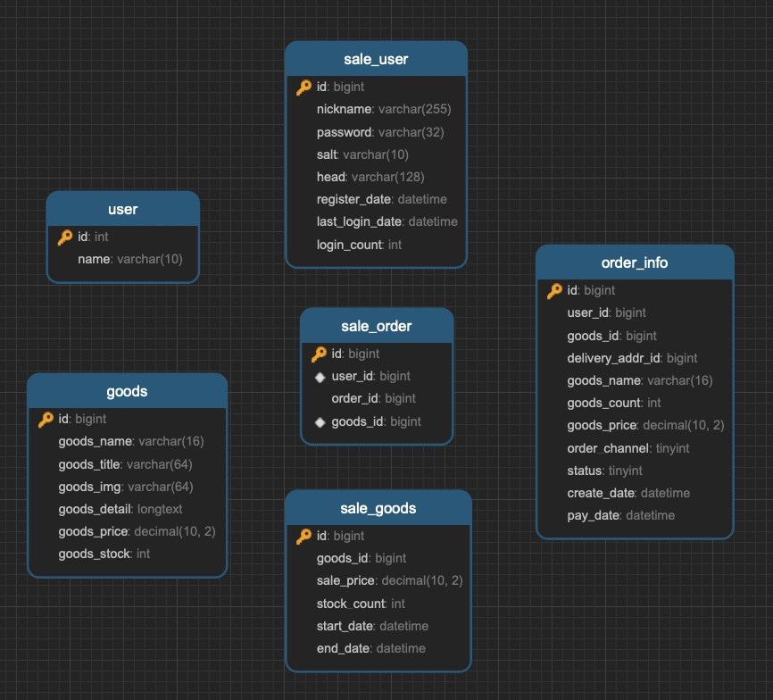

[toc]

# Flash Sale Distributed System

A distributed system for flash sale  implemented in Java.

## DB Schema

- mysql

  ```
  Port           : 3306
  Database       : flash_sale
  ```
	
	
	
  
  
  ```sql
  SET FOREIGN_KEY_CHECKS=0;
  
  -- ----------------------------
  -- Table structure for goods
  -- ----------------------------
  DROP TABLE IF EXISTS `goods`;
  CREATE TABLE `goods` (
    `id` bigint(20) NOT NULL AUTO_INCREMENT COMMENT 'ID',
    `goods_name` varchar(16) DEFAULT NULL COMMENT 'name',
    `goods_title` varchar(64) DEFAULT NULL COMMENT 'title',
    `goods_img` varchar(64) DEFAULT NULL COMMENT 'image',
    `goods_detail` longtext COMMENT 'detail',
    `goods_price` decimal(10,2) DEFAULT '0.00' COMMENT 'price',
    `goods_stock` int(11) DEFAULT '0' COMMENT 'stock，-1 represents no limit',
    PRIMARY KEY (`id`)
  ) ENGINE=InnoDB AUTO_INCREMENT=5 DEFAULT CHARSET=utf8mb4;
  
  -- ----------------------------
  -- Records of goods
  -- ----------------------------
  INSERT INTO `goods` VALUES ('1', 'iphoneX', 'Apple iPhone X (A1865) 64GB', '/img/iphonex.png', 'Apple iPhone X (A1865) 64GB', '8765.00', '10000');
  INSERT INTO `goods` VALUES ('2', 'Huawei Meta9', 'Huawei Mate 9 4GB+32GB', '/img/meta10.png', 'Huawei Mate 9 4GB+32GB', '3212.00', '-1');
  INSERT INTO `goods` VALUES ('3', 'iphone8', 'Apple iPhone 8 (A1865) 64GB', '/img/iphone8.png', 'Apple iPhone 8 (A1865) 64GB', '5589.00', '10000');
  INSERT INTO `goods` VALUES ('4', 'Mi 6', 'Mi 6 4GB+32GB', '/img/mi6.png', 'Mi 6 4GB+32GB', '3212.00', '10000');
  ```
  
  ```sql
  -- ----------------------------
  -- Table structure for sale_goods
  -- ----------------------------
  DROP TABLE IF EXISTS `sale_goods`;
  CREATE TABLE `sale_goods` (
    `id` bigint(20) NOT NULL AUTO_INCREMENT COMMENT 'Id',
    `goods_id` bigint(20) DEFAULT NULL COMMENT 'goods Id',
    `sale_price` decimal(10,2) DEFAULT '0.00' COMMENT 'sale price',
    `stock_count` int(11) DEFAULT NULL COMMENT 'stock count',
    `start_date` datetime DEFAULT NULL COMMENT 'sale start time',
    `end_date` datetime DEFAULT NULL COMMENT 'sale end time',
    PRIMARY KEY (`id`)
  ) ENGINE=InnoDB AUTO_INCREMENT=5 DEFAULT CHARSET=utf8mb4;
  
  
  -- ----------------------------
  -- Records of sale_goods
  -- ----------------------------
  INSERT INTO `sale_goods` VALUES ('1', '1', '0.01', '9', '2017-12-04 21:51:23', '2017-12-31 21:51:27');
  INSERT INTO `sale_goods` VALUES ('2', '2', '0.01', '9', '2017-12-04 21:40:14', '2017-12-31 14:00:24');
  INSERT INTO `sale_goods` VALUES ('3', '3', '0.01', '9', '2017-12-04 21:40:14', '2017-12-31 14:00:24');
  INSERT INTO `sale_goods` VALUES ('4', '4', '0.01', '9', '2017-12-04 21:40:14', '2017-12-31 14:00:24');
  ```
  
  ```sql
  -- ----------------------------
  -- Table structure for user
  -- ----------------------------
  DROP TABLE IF EXISTS `user`;
  CREATE TABLE `user` (
    `id` int(11) NOT NULL AUTO_INCREMENT,
    `name` varchar(10) DEFAULT NULL,
    PRIMARY KEY (`id`)
  ) ENGINE=InnoDB AUTO_INCREMENT=2 DEFAULT CHARSET=utf8mb4;
  
  -- ----------------------------
  -- Records of user
  -- ----------------------------
  INSERT INTO `user` VALUES ('1', 'Joshua');
  ```
  
  ```sql
  -- ----------------------------
  -- Table structure for sale_user
  -- ----------------------------
  DROP TABLE IF EXISTS `sale_user`;
  CREATE TABLE `sale_user` (
    `id` bigint(20) NOT NULL AUTO_INCREMENT COMMENT 'ID/phone number',
    `nickname` varchar(255) NOT NULL,
    `password` varchar(32) DEFAULT NULL COMMENT 'MD5(MD5(pass+salt) + salt)',
    `salt` varchar(10) DEFAULT NULL,
    `head` varchar(128) DEFAULT NULL COMMENT 'profile id',
    `register_date` datetime DEFAULT NULL COMMENT 'register date',
    `last_login_date` datetime DEFAULT NULL COMMENT 'last login time',
    `login_count` int(11) DEFAULT '0' COMMENT 'login count',
    PRIMARY KEY (`id`)
  ) ENGINE=InnoDB AUTO_INCREMENT=18912341246 DEFAULT CHARSET=utf8mb4;
  
  -- ----------------------------
  -- Records of sale_user
  -- ----------------------------
  INSERT INTO `sale_user` VALUES ('18912341238', '18612766138', 'b7797cce01b4b131b433b6acf4add449', '1a2b3c4d', null, '2019-01-09 17:08:16', null, '0');
  INSERT INTO `sale_user` VALUES ('18912341239', '18612766139', 'b7797cce01b4b131b433b6acf4add449', '1a2b3c4d', null, '2019-01-09 17:17:21', null, '0');
  INSERT INTO `sale_user` VALUES ('18912341240', '18612766139', 'b7797cce01b4b131b433b6acf4add449', '1a2b3c4d', null, '2019-01-11 11:35:39', null, '0');
  INSERT INTO `sale_user` VALUES ('18912341241', '18612766141', 'b7797cce01b4b131b433b6acf4add449', '1a2b3c4d', null, '2019-01-11 11:36:23', null, '0');
  INSERT INTO `sale_user` VALUES ('18912341242', '18612766145', 'b7797cce01b4b131b433b6acf4add449', '1a2b3c4d', null, '2019-01-11 11:38:29', null, '0');
  INSERT INTO `sale_user` VALUES ('18912341243', '18612766122', 'b7797cce01b4b131b433b6acf4add449', '1a2b3c4d', null, '2019-01-11 11:41:52', null, '0');
  INSERT INTO `sale_user` VALUES ('18912341244', '18612766133', 'b7797cce01b4b131b433b6acf4add449', '1a2b3c4d', null, '2019-01-11 11:43:24', null, '0');
  INSERT INTO `sale_user` VALUES ('18912341245', '18612766444', 'b7797cce01b4b131b433b6acf4add449', '1a2b3c4d', null, '2019-01-11 13:44:29', null, '0');
  ```
  
  ```sql
  -- ----------------------------
  -- Table structure for order_info
  -- ----------------------------
  DROP TABLE IF EXISTS `order_info`;
  CREATE TABLE `order_info` (
    `id` bigint(20) NOT NULL AUTO_INCREMENT,
    `user_id` bigint(20) DEFAULT NULL COMMENT 'user ID',
    `goods_id` bigint(20) DEFAULT NULL COMMENT 'goods ID',
    `delivery_addr_id` bigint(20) DEFAULT NULL COMMENT 'delivery address ID',
    `goods_name` varchar(16) DEFAULT NULL COMMENT 'goods name',
    `goods_count` int(11) DEFAULT '0' COMMENT 'goods count',
    `goods_price` decimal(10,2) DEFAULT '0.00' COMMENT 'goods price',
    `order_channel` tinyint(4) DEFAULT '0' COMMENT '1pc，2android，3ios',
    `status` tinyint(4) DEFAULT '0' COMMENT '0 no pay, 1 paid，2 sent，3 received，4 returned，5 finished',
    `create_date` datetime DEFAULT NULL COMMENT 'order create time',
    `pay_date` datetime DEFAULT NULL COMMENT 'payment date',
    PRIMARY KEY (`id`)
  ) ENGINE=InnoDB AUTO_INCREMENT=1565 DEFAULT CHARSET=utf8mb4;
  
  -- ----------------------------
  -- Records of order_info
  -- ----------------------------
  INSERT INTO `order_info` VALUES ('1561', '18912341234', '1', null, 'iphoneX', '1', '0.01', '1', '0', '2017-12-14 22:49:10', null);
  INSERT INTO `order_info` VALUES ('1562', '18912341234', '2', null, 'HUAWEi Meta9', '1', '0.01', '1', '0', '2017-12-14 22:55:42', null);
  INSERT INTO `order_info` VALUES ('1563', '18912341234', '4', null, 'Xiaomi 6', '1', '0.01', '1', '0', '2017-12-16 16:19:23', null);
  INSERT INTO `order_info` VALUES ('1564', '18912341234', '3', null, 'iphone8', '1', '0.01', '1', '0', '2017-12-16 16:35:20', null);
  ```
  
  ```sql
  -- ----------------------------
  -- Table structure for sale_order
  -- ----------------------------
  DROP TABLE IF EXISTS `sale_order`;
  CREATE TABLE `sale_order` (
    `id` bigint(20) NOT NULL AUTO_INCREMENT,
    `user_id` bigint(20) DEFAULT NULL COMMENT 'user ID',
    `order_id` bigint(20) DEFAULT NULL COMMENT 'order ID',
    `goods_id` bigint(20) DEFAULT NULL COMMENT 'goods ID',
    PRIMARY KEY (`id`),
    UNIQUE KEY `u_uid_gid` (`user_id`,`goods_id`) USING BTREE
  ) ENGINE=InnoDB AUTO_INCREMENT=1551 DEFAULT CHARSET=utf8mb4;
  
  -- ----------------------------
  -- Records of sale_order
  -- ----------------------------
  INSERT INTO `sale_order` VALUES ('1547', '18912341234', '1561', '1');
  INSERT INTO `sale_order` VALUES ('1548', '18912341234', '1562', '2');
  INSERT INTO `sale_order` VALUES ('1549', '18912341234', '1563', '4');
  INSERT INTO `sale_order` VALUES ('1550', '18912341234', '1564', '3');
  ```


## DAO (data access object)

Mapper

@Interface

sql statement to CRUD database record into domain model


## Service 

@Autowired DAO


### UserService

1. query user by userid


### GoodsService

1. List all goods info
2. List one good info by goodsid
3. reduce stock of one good in flash sale


### OrderService

1. query order by userid and goodsid
2. make an order: create an order info & sale


### SaleService


### SaleUserService


## VO


## API 

### login 

root route /login

1. GET /to_login
2. GET /do_login


### Register

root route /user

1. GET /do_register
2. GET /register


### Sale

root route /sale

1. GET /verifyCodeRegister
2. GET /verifyCode
3. GET /path


### Order

root route /order

1. GET /detail


### Goods

root route /goods

1. GET /to_list
2. GET /detail/{goodsid}
3. GET /to_deatil/{goodsid}
4. 


## Register & Login

### 前端注册界面 register.html

一、首先对注册信息进行验证：

1. 用户名
2. 密码
3. 确认密码
4. 验证码

二、设置全局 salt 值，根据输入密码生成独立 salt，并进行 md5 散列，得到加密后的密码

三、发送 ajax 请求到后端注册 url，包括用户名，密码，salt，验证码；返回成功则跳转到商品列表 url

四、后端 controller 通过 redis service 验证验证码，密码通过 salt 进行二次哈希存储到数据库 `password saved in MD5(MD5(pass+salt) + salt)`；注册成功通过 UUID 生成随机 token，最终 set cookie


### 前端登录界面 Login.html

一、form 采用 jquery validate 插件验证用户名和密码长度

二、发送 ajax 请求到后端注册 url，包括用户名，密码，salt，验证码；返回成功则跳转到商品列表 url


## Redis

使用 Jedis 连接 redis 中间件，使用 Jedis 打开一条Socket通道和Redis服务进行连接。

基于 JedisPoolConfig 进行连接池配置，(如最大连接数，最大空数等）。

https://www.jianshu.com/p/a1038eed6d44

```
        <dependency>
            <groupId>redis.clients</groupId>
            <artifactId>jedis</artifactId>
        </dependency>
```

定义 RedisConfig，引入配置信息

定义 RedisPoolFactory，根据 RedisConfig 配置 JedisPoolConfig，并管理 *JedisPool*，并注入 Bean


## Jmeter Stress Testing


