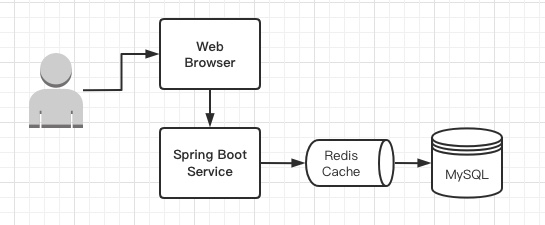
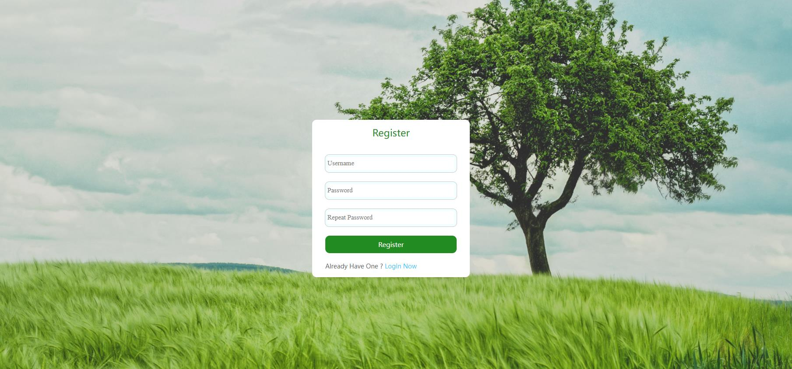
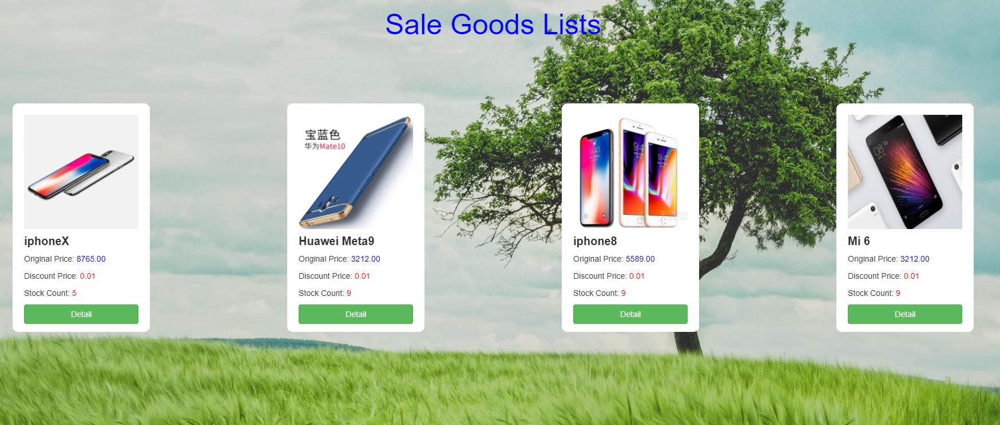
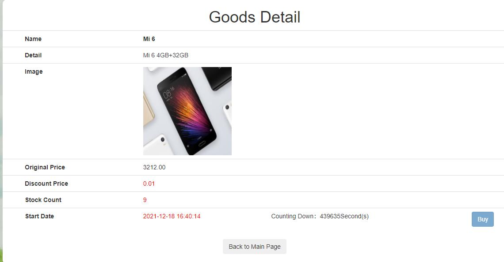
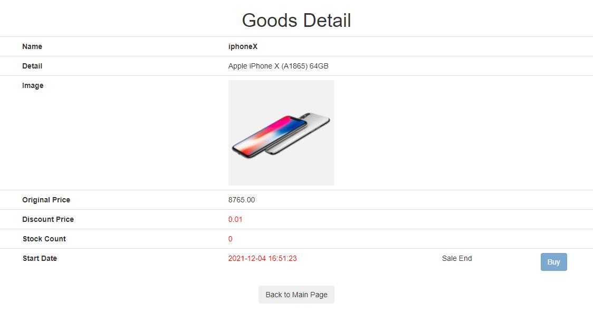
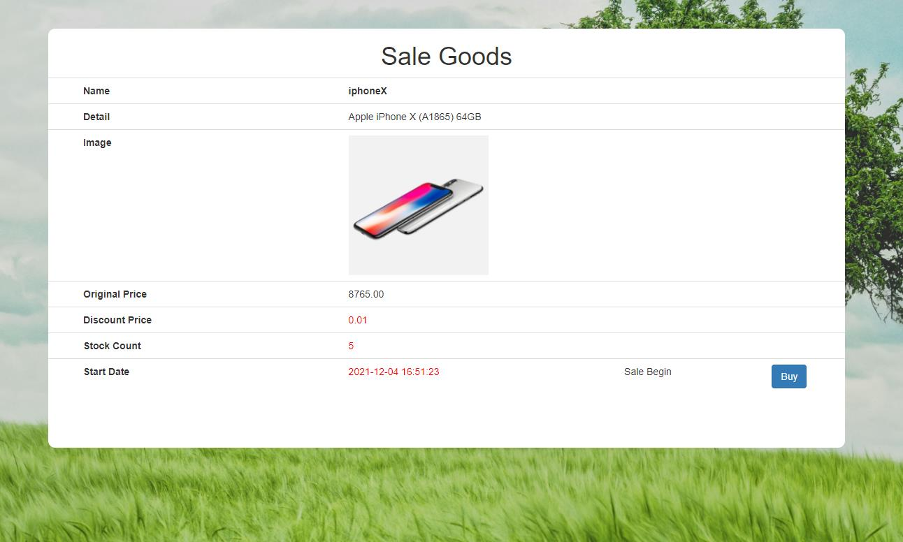
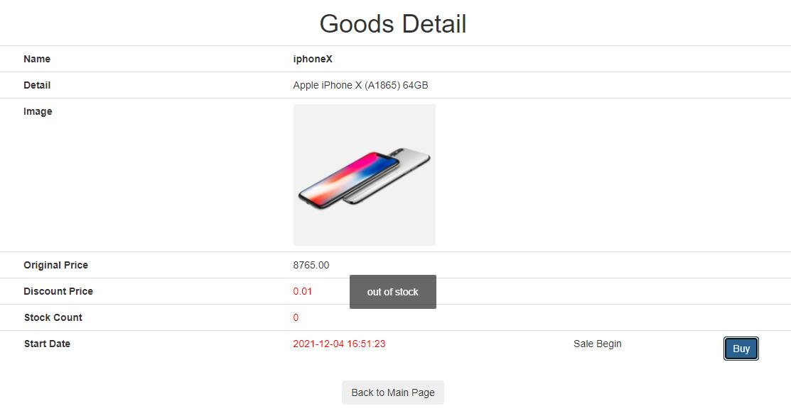
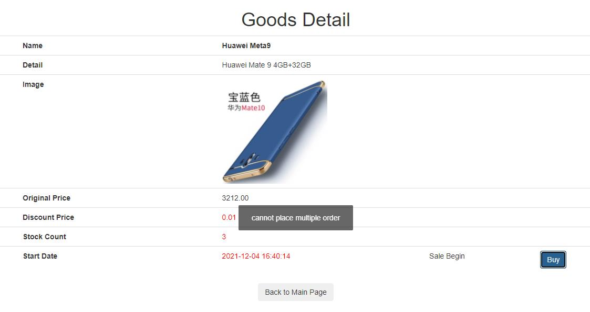
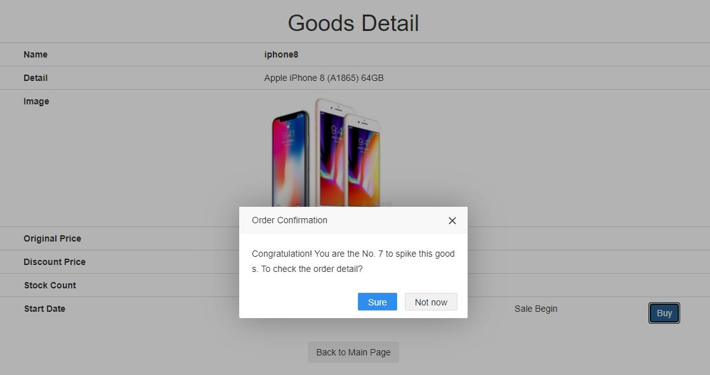
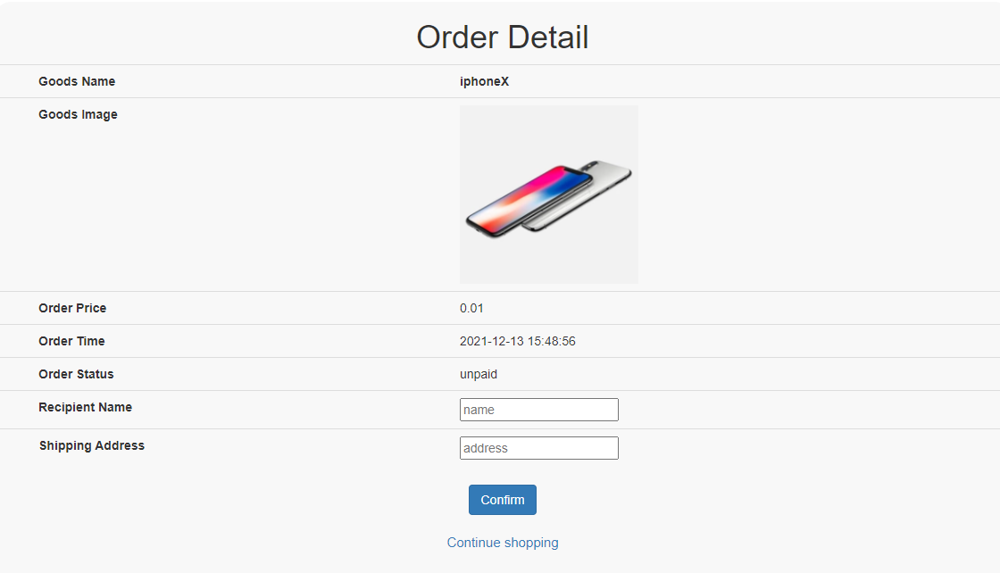

[toc]

# E-commerce system for spike sale

A online shopping web application based on Spring Boot, Redis, MySQL with native HTML5, CSS, JavaScript frontend.



## Function
- user login/register page
     
     

When user do login or register, a random salt will be added to the password and then use MD5 (a cryptographic hash algorithm) to get a fixed length string value sent to the server.

After authentication on the server side, the server will generate a random UUID as token and add it to the cookie. Also, we set the token value as key and user object as value in the Redis to maintain a session between client and server.

Everytime there is a request that need user has been logged in, we can verify the token from cookie by comparing the value from Redis. Once the authentication is success, we can access the user information and associate with a specific order. This is implemented by Interceptor that handles request before controller.

We also use ThreadLocal to set and get user object, which has per-thread data that cannot be accessed concurrently by other threads.


- sales goods page
   

To show all the goods on sale, we integrate Thymeleaf in Spring Boot. It applies a set of transformations to template files in order to display data or text produced by the application. The first time query of these goods information, we can put them into Redis in order to facilitate the following repeat query like display the detail of each goods.


- place order page

   
   
   

When looking up the detail of a product. If the current time is later than start time of the sale, there will be a timer that counts down the remaining seconds. When the sale begins, user can click the Buy button to place an order. When the sale ends, buy button will be disabled.


- order detail page
  
  
  
  

If the good is out of stock, user cannot place the order. There will be alert of "out of stock". In our system, the user cannot place multiple orders.It will show the alert if user have already bought the good. If succcesfully placed an order, it will show "you are the No. XXX to spike this product".Then you can check the detail of your order and enter your name and address. 


## DB Schema

- MySQL relational database 

  
  

We deploy our MySQL with the help of Docker container. 

```bash
docker run --name mysql -p 3306:3306 -e MYSQL_ROOT_PASSWORD=my-secret-pw -d mysql:latest
```


## Directory

- DAO (data access object):  simplifies the implementation of database access by mapping parameter objects to JDBC prepared statement parameters and mapping rows in JDBC result sets to objects.
- VO (View Object): define the objects that update the view and pass to the service.
- Service: business logic implementation of goods, order, user login and register with DAO.
- Controller:  handler the request from the DispatcherServlet. 
- Common: custom the format of response body and define several response statuses for rich error and exceptions handling.
- Access: Interceptor and HandlerMethodArgumentResolver.
- Redis: Redis client API for performing CRUD operations on key-value memory store.
- Util: MD5 hashing for password.


## API 

### login 

/login

1. GET /to_login
2. POST /do_login


### Register

/user

1. GET /do_register
2. POST /register


### Sale

/sale

1. GET /path
1. POST /{path}/do_sale

1. GET /result


### Order

/order

1. GET /detail


### Goods

/goods

1. GET /to_list
2. GET /detail/{goodsid}
3. GET /to_deatil/{goodsid}


## Redis

We deploy Redis with the help of Docker container. 

```bash
docker run --name redis -p 6379:6379 --requirepass=my-secret-pw -d redis:latest
```

Utilize Jedis to open a socket to connect to the Redis service.

Configure the connection pool based on JedisPoolConfig (such as the maximum number of connections, etc..)


